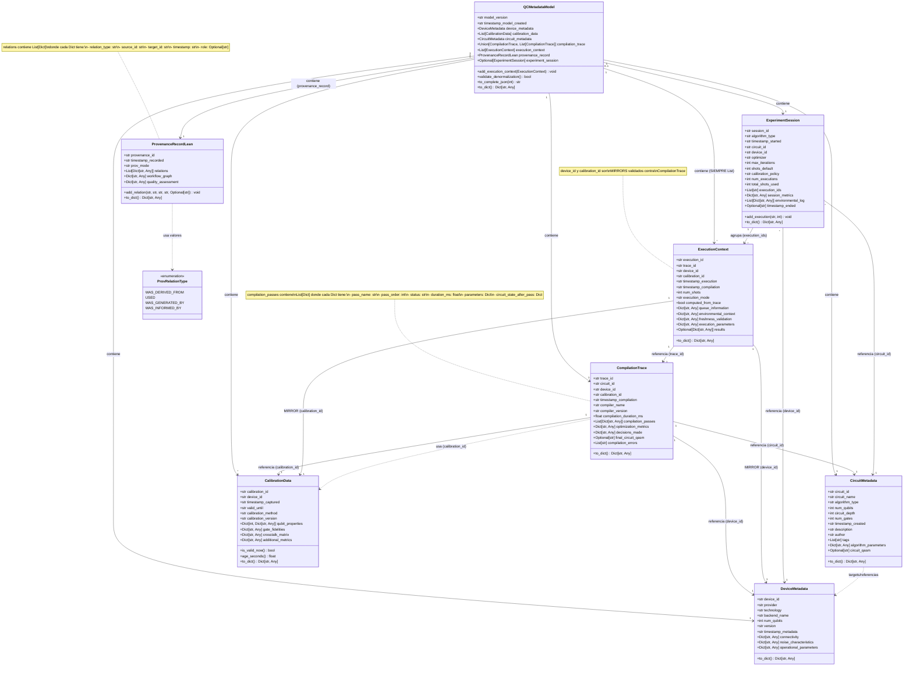

# Diagrama de Implementación Real: QCMetadata Model v1.1

## Diagrama basado en el código actual (`model/qc_metadata_model.py`)

Este diagrama refleja **exactamente** cómo están implementadas las clases en el código, incluyendo tipos de datos reales y estructuras anidadas.



## Notas Importantes sobre la Implementación

### 1. Componentes Auxiliares como Estructuras de Datos

**`CompilationPass`** (del diagrama conceptual):
- **NO existe como clase** en el código
- **SÍ existe como `Dict[str, Any]`** dentro de `CompilationTrace.compilation_passes: List[Dict[str, Any]]`
- Se genera mediante `extract_compilation_passes()` en `helpers.py`
- Estructura típica de cada Dict:
  ```python
  {
      "pass_name": "Unroll3qOrMore",
      "pass_order": 1,
      "status": "completed",
      "duration_ms": 123.45,
      "parameters": {"basis_gates": ["u", "cx"]},
      "circuit_state_after_pass": {"num_gates": 10, "circuit_depth": 5}
  }
  ```

**`ProvenanceRelation`** (del diagrama conceptual):
- **NO existe como clase** en el código
- **SÍ existe como `Dict[str, Any]`** dentro de `ProvenanceRecordLean.relations: List[Dict[str, Any]]`
- Se crea mediante `add_relation()` en `ProvenanceRecordLean`
- Estructura típica de cada Dict:
  ```python
  {
      "relation_type": "wasDerivedFrom",
      "source_id": "trace_123",
      "target_id": "circuit_456",
      "timestamp": "2025-11-19T15:23:07Z",
      "role": "compilation_input"  # opcional
  }
  ```

### 2. Tipos de Datos Específicos

- **`execution_context`**: **SIEMPRE** `List[ExecutionContext]` (nunca un solo objeto) - GAP-1 fix
- **`compilation_trace`**: `Union[CompilationTrace, List[CompilationTrace]]` (puede ser uno o varios)
- **`calibration_data`**: `List[CalibrationData]` (siempre lista, puede tener múltiples snapshots)
- **`experiment_session`**: `Optional[ExperimentSession]` (puede ser None)

### 3. Métodos Clave

- **`ProvenanceRecordLean.add_relation()`**: Crea y añade un Dict a `relations`
- **`QCMetadataModel.validate_denormalization()`**: Valida que los MIRRORS en `ExecutionContext` coincidan con `CompilationTrace`
- **`CalibrationData.is_valid_now()`**: Verifica si `valid_until` ha expirado
- **`QCMetadataModel.to_complete_json()`**: Serializa todo el modelo a JSON con validación

### 4. Diferencias con el Diagrama Conceptual

| Aspecto | Diagrama Conceptual | Implementación Real |
|---------|-------------------|---------------------|
| `ProvenanceRelation` | Clase separada | `Dict` dentro de `relations` |
| `CompilationPass` | Clase separada | `Dict` dentro de `compilation_passes` |
| `execution_context` | Puede ser objeto único | **SIEMPRE** `List[ExecutionContext]` |
| `provenance_record` | `ProvenanceRecordLean` | Mapeo directo ✅ |

## Archivos Relacionados

- **Implementación:** `model/qc_metadata_model.py`
- **Esquema JSON:** `model/schema_qc_metadata_v1.1.json`
- **Generación de passes:** `helpers.py::extract_compilation_passes()`
- **Uso en PoC:** `poc_ibm_cloud.py`, `thesis_experiments.py`

